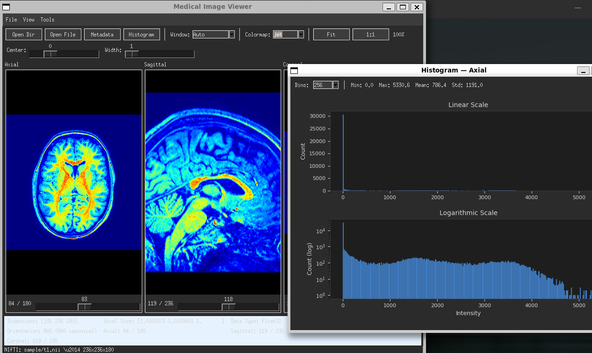

# Medical Image Viewer


A desktop medical image viewer for DICOM and NIfTI formats built with Tkinter. Designed for quick inspection of volumetric medical imaging data with windowing, multi-axis navigation, and metadata exploration.



## Features

### Image Loading
- **DICOM** — load a directory of DICOM files with automatic filtering (`pydicom.misc.is_dicom`) and InstanceNumber sorting
- **NIfTI** — load `.nii` / `.nii.gz` files with 3D+ volume support

### Viewing
- **Multi-axis NIfTI** — simultaneous axial, sagittal, and coronal panels with independent slice navigation
- **Single-axis DICOM** — slice slider with keyboard navigation (Left/Right, Home/End)
- **Zoom** — scroll wheel zoom per panel (0.1x–20x)
- **Pan** — middle-click drag

### Windowing & Colormaps
- **Window/Level presets** — Brain, Bone, Lung, Abdomen, Soft Tissue
- **Manual Center/Width sliders** — real-time adjustment
- **DICOM defaults** — reads WindowCenter/WindowWidth from DICOM tags
- **Colormaps** — gray, hot, jet, bone via toolbar dropdown

### Orientation
- **NIfTI** — reoriented to RAS canonical (`nib.as_closest_canonical`) with `rot90` for correct radiological display
- **DICOM** — horizontal flip (LPS) for standard radiological convention

### UI
- **Menu bar** — File (Open Dir, Open File, Exit), View (Metadata, Reset Zoom, Theme, Font Size, Font Weight), Tools (Window Presets)
- **Dark / Light theme** — selectable from View menu, `ttk` clam-based
- **Font configuration** — size (8–20) and weight (normal/bold) from View menu
- **Status bar** — pixel coordinates, intensity value, dimensions, zoom level under cursor
- **Info bar** — patient/image metadata (format-aware: Patient ID, Modality for DICOM; Dimensions, Voxel Size, Orientation for NIfTI)

### Metadata Viewer
- DICOM tag browser with sequence expansion and VR column
- NIfTI header key/value display
- Search/filter across name, value, and VR fields
- Right-click to copy value to clipboard
- Horizontal and vertical scrollbars

### Keyboard Shortcuts

| Shortcut | Action |
|----------|--------|
| `Ctrl+O` | Open DICOM directory |
| `Ctrl+Shift+O` | Open NIfTI file |
| `Ctrl+M` | Show metadata |
| `Ctrl+0` | Reset zoom |
| `Ctrl+Q` | Exit |
| `Left` / `Right` | Previous / next slice |
| `Home` / `End` | First / last slice |

## Project Structure

```
viewer/
├── __init__.py
├── __main__.py          # CLI entry point (argparse)
├── app.py               # Tk root setup, theme init, resize debounce
├── controllers/
│   └── viewer.py        # Main controller — wires model, views, callbacks
├── models/
│   ├── base.py          # ImageVolume ABC
│   ├── dicom.py         # DicomVolume (filtering, sorting, LRU cache, LPS)
│   └── nifti.py         # NiftiVolume (RAS reorientation, multi-axis)
├── views/
│   ├── canvas.py        # Single image canvas with zoom/pan/cursor tracking
│   ├── info_bar.py      # Data-driven info bar
│   ├── menubar.py       # File/View/Tools menus
│   ├── metadata.py      # Metadata window with search and copy
│   ├── multi_canvas.py  # 3-panel multi-axis view with per-panel zoom/pan
│   └── toolbar.py       # Toolbar with controls and W/L sliders
└── utils/
    ├── image.py          # Resize utilities
    ├── normalization.py  # Min-max, windowing, colormaps
    └── theme.py          # Dark/light palette, font management
tests/
├── test_dicom.py         # DicomVolume unit tests (synthetic DICOM)
├── test_nifti.py         # NiftiVolume unit tests (in-memory NIfTI)
├── test_normalization.py # Normalization/windowing/colormap tests
└── test_image.py         # Resize utility tests
```

## Prerequisites

- Python 3.10 or higher
- Tk/Tcl (included with most Python installations)

## Installation

Clone and install with pip:

```bash
git clone https://github.com/jpabloglez/image-viewer.git
cd image-viewer
pip install -e .
```

Or install dependencies directly:

```bash
pip install -r requirements.txt
```

## Usage

```bash
# Open a DICOM directory
python -m viewer -d /path/to/dicom/directory

# Open a NIfTI file
python -m viewer -i /path/to/file.nii.gz

# Launch without arguments (use File menu or toolbar to open)
python -m viewer

# Enable debug logging
python -m viewer -d /path/to/dicom --log-level DEBUG
```

## Testing

```bash
# Install test dependencies
pip install -e ".[test]"

# Run tests
python -m pytest tests/ -v

# Run with coverage
python -m pytest tests/ -v --cov=viewer --cov-report=term-missing

# Lint
pip install ruff
ruff check viewer/ tests/
```

See [tests/README.md](tests/README.md) for details on test modules and data strategy.

## CI

GitHub Actions runs on every push/PR to `main`:
- **Lint** — `ruff check` on viewer and tests
- **Test** — `pytest` with coverage on Python 3.10, 3.11, 3.12

## Architecture

The application follows an **MVC pattern**:

- **Models** (`ImageVolume` ABC) handle file I/O and return raw numpy arrays — no Tkinter dependency
- **Views** are Tkinter widgets that display data and emit callbacks — no model knowledge
- **Controller** (`ViewerController`) wires models to views, manages state, and orchestrates the render pipeline: `model.get_slice()` → normalize/window → colormap → PIL Image → canvas display

File loading runs on background threads with `root.after()` for Tkinter-safe UI updates. DICOM pixel data is cached with `@lru_cache(maxsize=64)`.

## License

This project is licensed under the MIT License — see the [LICENSE](LICENSE) file for details.
