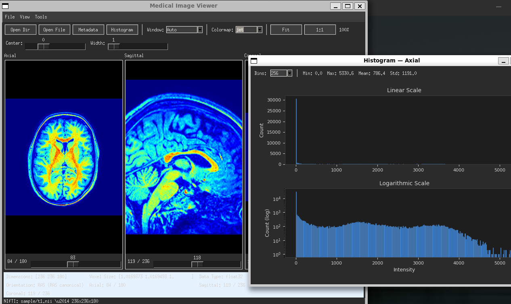

# Medical Image Viewer


A desktop medical image viewer for DICOM and NIfTI formats built with Tkinter. Designed for quick inspection of volumetric medical imaging data with windowing, multi-axis navigation, and metadata exploration.



**▶ [![Watch the demo]](https://github.com/jpabloglez/viewer-tk/blob/main/docs/recording-viewer-tk.webp)**


## Features

### Image Loading
- **DICOM** — load a directory of DICOM files with automatic filtering (`pydicom.misc.is_dicom`), InstanceNumber sorting, and multi-frame file support; progress bar during header scan
- **NIfTI** — load `.nii` / `.nii.gz` files; 3D and 4D (fMRI/DWI) volumes with a time/volume slider

### Viewing
- **Multi-axis NIfTI** — simultaneous axial, sagittal, and coronal panels with crosshair linking (click one panel to navigate the others)
- **Single-axis DICOM** — slice slider with keyboard navigation (Left/Right, Home/End)
- **Zoom** — scroll wheel zoom per panel (0.1x–20x)
- **Pan** — middle-click drag

### Windowing & Colormaps
- **Window/Level presets** — Brain, Bone, Lung, Abdomen, Soft Tissue
- **Manual Center/Width sliders** — real-time adjustment
- **Right-click drag** — adjust window/level directly on the image (vertical → center, horizontal → width)
- **Auto W/L** — set from 2nd–98th percentile of the current slice
- **Invert** — grayscale inversion toggle
- **DICOM defaults** — reads WindowCenter/WindowWidth from DICOM tags
- **Colormaps** — gray, hot, jet, bone via toolbar dropdown

### Measurement
- **Distance tool** — click two points on the image canvas; distance reported in mm (using DICOM PixelSpacing / NIfTI pixdim) or pixels when spacing is unavailable

### Orientation
- **NIfTI** — reoriented to RAS canonical (`nib.as_closest_canonical`) with `rot90` for correct radiological display
- **DICOM** — horizontal flip (LPS) for standard radiological convention

### UI
- **Menu bar** — File (Open Dir/File, Open Recent, Save View), View (Metadata, Reset Zoom, Theme, Font), Tools (Window Presets, Histogram), Help (Keyboard Shortcuts)
- **Recent files** — `File → Open Recent` persists the last 10 opened paths
- **Save view** — export the current rendered slice to PNG/JPEG (`Ctrl+S`)
- **Dark / Light theme** — selectable from View menu, `ttk` clam-based; persisted across sessions
- **Font configuration** — size (8–20) and weight (normal/bold) from View menu; persisted
- **Status bar** — pixel coordinates, intensity value, dimensions, zoom level under cursor
- **Info bar** — patient/image metadata (format-aware)
- **Empty-state hint** — on first launch, the canvas shows shortcut reminders

### Metadata Viewer
- DICOM tag browser with sequence expansion and VR column
- NIfTI header key/value display
- Search/filter across name, value, and VR fields
- Right-click to copy value to clipboard

### Keyboard Shortcuts

| Shortcut | Action |
|----------|--------|
| `Ctrl+O` | Open DICOM directory |
| `Ctrl+Shift+O` | Open NIfTI file |
| `Ctrl+S` | Save current view as PNG/JPEG |
| `Ctrl+M` | Show metadata browser |
| `Ctrl+H` | Show histogram |
| `Ctrl+0` | Reset zoom |
| `Ctrl+Q` | Exit |
| `Left` / `Right` | Previous / next slice |
| `Home` / `End` | First / last slice |
| Scroll wheel | Zoom in / out |
| Middle-drag | Pan image |
| Right-drag | Adjust window/level |
| Left-click* | Place measurement point (*Measure mode on) |
| `?` | Keyboard shortcuts overlay |

## Project Structure

```
viewer/
├── __init__.py
├── __main__.py          # CLI entry point — auto-detects DICOM dir vs NIfTI file
├── app.py               # Tk root setup, theme init, resize debounce
├── controllers/
│   └── viewer.py        # Main controller — wires model, views, callbacks
├── models/
│   ├── base.py          # ImageVolume ABC
│   ├── dicom.py         # DicomVolume (filtering, sorting, LRU cache, LPS, multi-frame)
│   └── nifti.py         # NiftiVolume (RAS reorientation, multi-axis, 4D)
├── views/
│   ├── canvas.py        # Single image canvas with zoom/pan/measure/W-L drag
│   ├── histogram.py     # Histogram window (requires matplotlib extra)
│   ├── info_bar.py      # Data-driven info bar
│   ├── menubar.py       # File/View/Tools/Help menus
│   ├── metadata.py      # Metadata window with search and copy
│   ├── multi_canvas.py  # 3-panel multi-axis view with crosshair linking
│   └── toolbar.py       # Toolbar with controls, W/L sliders, Auto W/L, Invert, Measure
└── utils/
    ├── image.py          # Resize utilities
    ├── normalization.py  # Min-max, windowing, LUT colormaps (no matplotlib on render path)
    ├── prefs.py          # Preferences persistence (~/.config/neuro-viewer-tk/prefs.json)
    ├── recent.py         # Recent files persistence (~/.config/neuro-viewer-tk/recent.json)
    ├── strings.py        # Centralized UI strings and status messages
    └── theme.py          # Dark/light palette, font management
tests/
├── test_controller.py    # Controller smoke tests (headless Tk with xvfb)
├── test_dicom.py         # DicomVolume unit tests (synthetic DICOM)
├── test_nifti.py         # NiftiVolume unit tests (in-memory NIfTI)
├── test_normalization.py # Normalization/windowing/colormap tests
└── test_image.py         # Resize utility tests
```

## Prerequisites

- Python 3.10 or higher
- Tk/Tcl (included with most Python installations; on Linux: `sudo apt install python3-tk`)

## Installation

### Recommended: install as a global CLI tool with `uv`

```bash
# Install from a local checkout (no venv management needed)
uv tool install --from . neuro-viewer-tk

# Run from anywhere
viewer-tk /path/to/scan/

# Run without installing (ephemeral)
uvx --from . neuro-viewer-tk /path/to/scan/
```

Once published to PyPI:

```bash
uv tool install neuro-viewer-tk
```

### Development install

```bash
git clone https://github.com/jpabloglez/image-viewer.git
cd image-viewer
pip install -e .
```

### Optional: matplotlib for histogram

```bash
pip install -e ".[plot]"
```

## Usage

```bash
# Auto-detect: directory → DICOM, file → NIfTI
viewer-tk /path/to/dicom/directory
viewer-tk /path/to/file.nii.gz

# Explicit flags (still supported)
viewer-tk -d /path/to/dicom/directory
viewer-tk -i /path/to/file.nii.gz

# Launch without arguments (use File menu or toolbar to open)
viewer-tk

# Enable debug logging
viewer-tk /path/to/scan --log-level DEBUG
```

If installed with `pip install -e .` and not using the console script:

```bash
python -m viewer /path/to/scan
```

## Testing

```bash
# Install test dependencies
pip install -e ".[test]"

# Run tests
python -m pytest tests/ -v

# Run with coverage
python -m pytest tests/ -v --cov=viewer --cov-report=term-missing

# Lint
ruff check viewer/ tests/

# Type check
mypy viewer/ --ignore-missing-imports --no-strict-optional
```

## CI

GitHub Actions runs on every push/PR to `main`:
- **Lint** — `ruff check` + `mypy` on viewer and tests
- **Test** — `pytest` with coverage on Python 3.10, 3.11, 3.12 (headless with `xvfb`)

## Architecture

The application follows an **MVC pattern**:

- **Models** (`ImageVolume` ABC) handle file I/O and return raw numpy arrays — no Tkinter dependency
- **Views** are Tkinter widgets that display data and emit callbacks — no model knowledge
- **Controller** (`ViewerController`) wires models to views, manages state, and orchestrates the render pipeline: `model.get_slice()` → normalize/window → colormap → PIL Image → canvas display

File loading runs on background threads with `root.after()` for Tkinter-safe UI updates. DICOM pixel data is cached with `@lru_cache(maxsize=64)`. Preferences (theme, font, colormap) are persisted to `~/.config/neuro-viewer-tk/prefs.json`.

## License

This project is licensed under the MIT License — see the [LICENSE](LICENSE) file for details.
